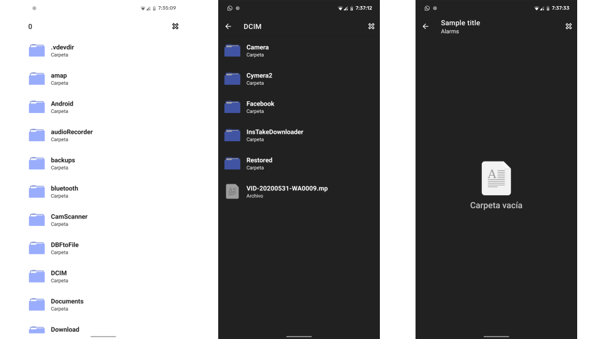

# Material File Picker Unofficial
Material file picker library for Android by Arte al Programar



## What's new
- Require Android Jelly Bean 4.1.x (API 16+)
- Android 10 Compatibility
- Material Components for Android Support
- Night Mode Support
- New Icon Designs 


## Add your project

Download library and add it to your project

or use `JitPack.io`

```
build.gradle (Project)

allprojects {
    repositories {
        jcenter()
        maven { url "https://jitpack.io" }
    }
}


build.gradle (Module: app)

dependencies {
    ...
    implementation 'com.github.arteaprogramar:MaterialFilePicker:version'
}


```

## Using (IMPORTANT)

- Add to Values

```
colors.xml
<resources>
    ...
    <color name="colorBackground">#fafafa</color>
    ...
</resources>

styles.xml

<resources>

    ...
    <item name="android:colorBackground">@color/colorBackground</item>
    ...
</resources>

```

- Open your class and add the following code

```
...
public static final int FILE_PICKER_REQUEST_CODE = 989
...

MaterialFilePicker()
    // Pass a source of context. Can be:
    //    .withActivity(Activity activity)
    //    .withFragment(Fragment fragment)
    //    .withSupportFragment(androidx.fragment.app.Fragment fragment)
    .withActivity(this)
    // With cross icon on the right side of toolbar for closing picker straight away
    .withCloseMenu(true)
    // Entry point path (user will start from it)
    .withPath(alarmsFolder.absolutePath)
    // Root path (user won't be able to come higher than it)
    .withRootPath(externalStorage.absolutePath)
    // Showing hidden files
    .withHiddenFiles(true)
    // Want to choose only jpg images
    .withFilter(Pattern.compile(".*\\.(jpg|jpeg)$"))
    // Don't apply filter to directories names
    .withFilterDirectories(false)
    .withTitle("Sample title")
    .withRequestCode(FILE_PICKER_REQUEST_CODE)
    .start()
...

```

Override on activity result:

```java
@Override
protected void onActivityResult(int requestCode, int resultCode, Intent data) {
    super.onActivityResult(requestCode, resultCode, data);

    if (requestCode == FILE_PICKER_REQUEST_CODE && resultCode == RESULT_OK) {
        String filePath = data.getStringExtra(FilePickerActivity.RESULT_FILE_PATH);
        // Do anything with file
    }
}
```

Runtime permissions:

You should handle runtime permissions in activity, from what you called Material File Picker.
Look [here](https://github.com/nbsp-team/MaterialFilePicker/blob/master/app/src/main/java/com/dimorinny/sample/MainActivity.java#L38-L69) for example code.

